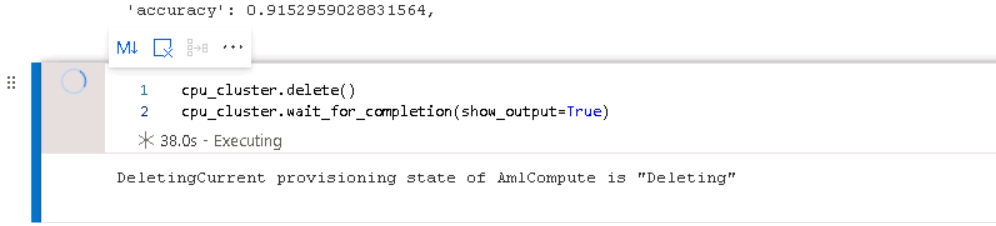

# Optimizing an ML Pipeline in Azure

## Overview
In this project, we create and optimize an ML pipeline. We are provided with a custom-coded model—a standard scikit-learn Logistic Regression. First part is to optimize the hyperparameters using HyperDrive. Second part of the project is to use AutoML to build and optimize a model on the same dataset, so that we can compare the results of the two methods.

The main steps are depicted in the diagram below:


## Summary
This dataset contains data related to a bank's marketing campaign. The data consists of details including age, education, job, marital status and column "y". We have to predict and classify the value of column "y" into either 0 or 1. A custom python model uses logistic regression algorithm for classification and used by HyperDrive to optimize the hyperparameters.

On the other hand, Auomated ML using python SDK is also used to find the best performing model on the same dataset.

## Custom Python model based on scikit-learn's Logistic Regression 

### Preparing Python Model used for Training - train.py:

#### Import Data
A custom python model is prepared that will be used for training. The model imports the data from the given dataset. 
```python
ds = TabularDatasetFactory.from_delimited_files(path="https://automlsamplenotebookdata.blob.core.windows.net/automl-sample-notebook-data/bankmarketing_train.csv",validate=True,
        include_path=False, infer_column_types=True, set_column_types=None, separator=',', header=True, partition_format=None, support_multi_line=False, empty_as_string=False
    )
```
#### Clean Data
After the data is imported, the data is cleaned using the function clean_data where we first drop missing values, then use lambda functions to one-hot encode the dataframe. 
```python
    months = {"jan":1, "feb":2, "mar":3, "apr":4, "may":5, "jun":6, "jul":7, "aug":8, "sep":9, "oct":10, "nov":11, "dec":12}
    weekdays = {"mon":1, "tue":2, "wed":3, "thu":4, "fri":5, "sat":6, "sun":7}
    
    x_df = data.to_pandas_dataframe().dropna()
    jobs = pd.get_dummies(x_df.job, prefix="job")
    x_df.drop("job", inplace=True, axis=1)
    ...
    x_df["marital"] = x_df.marital.apply(lambda s: 1 if s == "married" else 0)
    x_df["default"] = x_df.default.apply(lambda s: 1 if s == "yes" else 0)
    ...
    contact = pd.get_dummies(x_df.contact, prefix="contact")
    x_df.drop("contact", inplace=True, axis=1)
    x_df = x_df.join(contact)
    ...
    x_df["month"] = x_df.month.map(months)
    x_df["day_of_week"] = x_df.day_of_week.map(weekdays)
    ...
    y_df = x_df.pop("y").apply(lambda s: 1 if s == "yes" else 0)
```
#### Split data into train and test sets.
Then we split the data into train and test sets with 20% of the data used as test.
```python
x_train, x_test, y_train, y_test = train_test_split(x, y, test_size=0.2, random_state=42)
```

#### Define Hyperparameters as Arguments for Logistic Regression
```python
parser.add_argument('--C', type=float, default=1.0, help="Inverse of regularization strength. Smaller values cause stronger regularization")
parser.add_argument('--max_iter', type=int, default=100, help="Maximum number of iterations to converge")
```
#### Logistic Regression
The classification technique used is the Logistic Regression.
```python
model = LogisticRegression(C=args.C, max_iter=args.max_iter).fit(x_train, y_train)
```
We then fit the model and score against the test set to find the accuracy of the model.
```python
accuracy = model.score(x_test, y_test)
```

The model is ready and saved as train.py.

## Part 1 - Hyperparameter Tuning using HyperDrive

Once the python model (train.py) is ready, we start our exercise, first, by using HyperDrive to tune the hyperparameters to achieve higher accuracy metric. We switch over to Jupyter Notebook, to run both Part 1 and Part 2 of this project. To recap, part 1 is manual hyperparameter tuning with HyperDrive and part 2 is using AutoML to find the best model.

### Hyperparameters
Hyperparameters are adjustable parameters that let us control the model training process. For example, with random forest, we decide the number of estimators (decision trees) and the depth of each tree. Model performance depends heavily on hyperparameters.

Hyperparameter tuning, also called hyperparameter optimization, is the process of finding the configuration of hyperparameters that results in the best performance. The process is typically computationally expensive and manual. HyperDrive lets us automate hyperparameter tuning and run experiments in parallel to efficiently optimize hyperparameters.

In this Part 1, we tuned the Regularization Strength (C) and the Max Iterations (max_Iter) with the Hyperdrive method. We have used the parameter sampler, to change the value of C and max_iter.
```python
ps = RandomParameterSampling({
    "--C": choice(1,10,100),
    "--max_iter": choice(50,100,150)
})
```
Note the the lower values of C cause stronger regularization. And max_iter specifies the maximum number of iterations for the model to converge. The benefits of the chosen parameters sample are to reduce the computational costs and speed up the results reducing the max_iter for example. 
### Early Termination Policy - Bandit
Bandit is an early termination policy based on slack factor/slack amount and evaluation interval. The policy early terminates any runs where the primary metric is not within the specified slack factor/slack amount with respect to the best performing training run. 
The Bandit policy takes the following configuration parameters:

**slack_factor or slack_amount**: The slack allowed with respect to the best performing training run. slack_factor specifies the allowable slack as a ration. slack_amount specifies the allowable slack as an absolute amount, instead of a ratio.

**evaluation_interval**: Optional. The frequency for applying the policy. Each time the training script logs the primary metric counts as one interval.

**delay_evaluation**: Optional. The number of intervals to delay the policy evaluation. We may use this parameter to avoid premature termination of training runs. If specified, the policy applies every multiple of evaluation_interval that is greater than or equal to delay_evaluation.

```python
bpolicy =  BanditPolicy(slack_factor = 0.1, evaluation_interval=1)
```
Any run that doesn't fall within the slack factor or slack amount of the evaluation metric with respect to the best performing run will be terminated.

### Create a HyperDriveConfig using the estimator, hyperparameter sampler, and policy.

Prepare the HyperDrive Configuration to start the hyperdrive run. It consists of hyperparameters, defining the parameter search space, specifying a primary metric to optimize, specifying early termination policy for low-performing runs, etc.

We specify the primary metric that the hyperparameter tuning optimizes. Each training run is evaluated for the primary metric. The early termination policy uses the primary metric to identify low-performance runs. 
* primary_metric_name: The name of the primary metric needs to exactly match the name of the metric logged by the training script
* primary_metric_goal: It can be either PrimaryMetricGoal.MAXIMIZE or PrimaryMetricGoal.MINIMIZE and determines whether the primary metric will be maximized or minimized when evaluating the runs.

Below configuration is to maximize 'accuracy'.

```python
hd_config = HyperDriveConfig(estimator=est,
                             hyperparameter_sampling=ps,
                             policy=bpolicy,
                             primary_metric_name="accuracy",
                             primary_metric_goal=PrimaryMetricGoal.MAXIMIZE,
                             max_total_runs=80,
                             max_concurrent_runs=4)
```

### Submit the HyperDrive Run
Run the experiment to execute the HyperDrive.
```python
hyperdrive_run = exp.submit(hd_config, show_output=True)
RunDetails(hyperdrive_run).show()
```

### Get the best run and save the model from that run.

```python
best_run = hyperdrive_run.get_best_run_by_primary_metric()
best_run.register_model(model_name="bankmarketing_model",model_path="outputs/bestrunmodel.joblib")
```
### Result of Part 1 - HyperDrive Results
Below are the metrics from the results. The Hypderdrive best run model is attached in the code files (HyperDrive_bestrunmodel.joblib).

**Metrics**
> {'Regularization Strength:': 100.0,
> 'Max iterations:': 50,
> 'accuracy': 0.9072837632776934}

## Part 2 - AutoML
This is the part 2 of the project which is to identify the best model with higher accuracy metric, using Automated ML (AutoML). This exercise uses AutoML SDK using Python and developed and run on Jupyter Notebook.
### Load Data
Firstly, we load the data into the dataset in the Jupyter Notebook.
```python
ds = TabularDatasetFactory.from_delimited_files(path="https://automlsamplenotebookdata.blob.core.windows.net/automl-sample-notebook-data/bankmarketing_train.csv",validate=True,
        include_path=False, infer_column_types=True, set_column_types=None, separator=',', header=True, partition_format=None, support_multi_line=False, empty_as_string=False
    )
```
### Clean Data
Next we clean data using the existing clean_data function that we wrote in train.py. For this we need to import the python file and call the same function.
```python
from train import clean_data
# Use the clean_data function to clean the data.
x, y = clean_data(ds)
```
### Split Data - train, test sets
Then we split the data into training and test sets, with 20% as test.
```python
from sklearn.model_selection import train_test_split
x_train, x_test, y_train, y_test = train_test_split(x, y, test_size=0.2, random_state=42)
```
### AutoML Config
Next step is to prepare the AutoML configuration. Here we pass on the details such as AutoML task, primary metric, compute target (for remote execution), training dataset and label column.

Automated ML calculates performance metrics for each classification model generated for the experiment. These metrics are based on the scikit learn implementation. Scikit-learn provides several averaging methods, three of which automated ML exposes: macro, micro, and weighted.

* Macro - Calculate the metric for each class and take the unweighted average
* Micro - Calculate the metric globally by counting the total true positives, false negatives, and false positives (independent of classes).
* Weighted - Calculate the metric for each class and take the weighted average based on the number of samples per class.

We use AUC-Weighted as the primary metric for the AutoML configuration. AUC is the Area under the Receiver Operating Characteristic Curve. AUC_weighted is the arithmetic mean of the score for each class, weighted by the number of true instances in each class.

```python
automl_config = AutoMLConfig(
    experiment_timeout_minutes=30,
    task="classification",
    primary_metric="AUC_weighted",
    compute_target=cpu_cluster,
    enable_onnx_compatible_models=True,
    training_data=ds,
    label_column_name="y",
    n_cross_validations=5)
```
During AutoML experiment execution, each child run needs to validate the related model by calculating the quality metrics for that model (in our case AUC weighted). These metrics are calculated by comparing the predictions made with each model with real labels from past observations in the validation data. AutoML experiments perform model validation automatically. To perform cross-validation, we have included the n_cross_validations parameter. This parameter sets how many cross validations to perform, based on the same number of folds. In the above code, five folds for cross-validation are defined. Hence, five different trainings, each training using 4/5 of the data, and each validation using 1/5 of the data with a different holdout fold each time.

As a result, metrics are calculated with the average of the five validation metrics.

### Submit the AutoML run
Finally, the AutoML run is submitted.
```python
experiment = Experiment(ws, "automl_experiment")
automl_run = experiment.submit(config=automl_config, show_output=True)
```
### Result of Part 2 - AutoML Results
The Automated ML ran across about 24 algorithms to find the best model with highest accuracy from among them. The AutoML identified the VotingEnsemble as the best model with the highest score of 
> 0.9497447408619287 

with higher accuracy than the other models.
> Accuracy:  0.9152959028831564

#### Hyperparameters used in AutoML
```python
num_leaves=242,
objective=None,
random_state=None
reg_alpha=1,
reg_lambda=0.6842105263157894,
silent=True,
subsample=0.7921052631578948,
subsample_for_bin=200000,
subsample_freq=0,
verbose=False,
weights=[0.46153846153846156,0.23076923076923078,0.07692307692307693,0.15384615384615385,0.07692307692307693]
```
#### Voting Ensemble Model

A voting ensemble (or a “majority voting ensemble“) is an ensemble machine learning model that combines the predictions from multiple other models. The ensemble iterations appear as the final iterations of the run. Automated machine learning uses both voting and stacking ensemble methods for combining models. 

Voting Ensemble predicts based on the weighted average of predicted class probabilities (for classification tasks) or predicted regression targets (for regression tasks).

Below are the metrics from the results. The AutoML best run model is attached in the code files (AutoML.zip).

```python
Metrics:
{'average_precision_score_weighted': 0.9567603493151342,
 'log_loss': 0.17160993479203826,
 'recall_score_macro': 0.7470776626951169,
 'matthews_correlation': 0.5407740687046443,
 'recall_score_micro': 0.9152959028831564,
 'recall_score_weighted': 0.9152959028831564,
 'AUC_micro': 0.9813537916694489,
 'average_precision_score_macro': 0.8293929611704323,
 'weighted_accuracy': 0.9570768834869648,
 'f1_score_macro': 0.7683374100042548,
 'f1_score_micro': 0.9152959028831564,
 'precision_score_micro': 0.9152959028831564,
 'precision_score_weighted': 0.909352865761616,
 'AUC_macro': 0.9497447408619287,
 'balanced_accuracy': 0.7470776626951169,
 'norm_macro_recall': 0.4941553253902338,
 'f1_score_weighted': 0.9115096834098064,
 'accuracy': 0.9152959028831564,
 'precision_score_macro': 0.7959733523919279,
 'AUC_weighted': 0.9497447408619287,
 'average_precision_score_micro': 0.9821560772110193,
 'confusion_matrix': 'aml://artifactId/ExperimentRun/dcid.AutoML_24c10d02-42ef-40c9-95d9-ea669a6075b7_24/confusion_matrix',
 'accuracy_table': 'aml://artifactId/ExperimentRun/dcid.AutoML_24c10d02-42ef-40c9-95d9-ea669a6075b7_24/accuracy_table'
 }
```
## Pipeline Comparison - HyperDrive vs AutoML

With the Hyperdrive method we got an accuracy of 0.907 and, with the AutoML model we got an accuracy of 0.915. Though the difference is small, the AutoML has returned a higher accuracy model.

Metric | HyperDrive | AutoML
------------ | ------------ | -------------
Accuracy | 0.9072837632776934 | 0.9152959028831564
Model | Logistic Regression | Voting Ensemble

Moreover, the AutoML identified model and tuned it automatically, testing different algorithms and selecting the best model (in this case VotingEnsemble) with the highest score (0.9497447408619287). 


## Road Ahead

* The data that we considered was about 32950 records. 
* We could run similar comparison with much larger datasets and see how AutoML performs. 
* The experiments were run on CPU based clusters. Using GPU based clusters would decrease the overall run time.
* Also, different algorithms may be used to cross verify performance of the model.
* However, usually for relational datasets, logistic regression has higher accuracy for classification.

## Proof of Cluster Delete

Kindly note that the cluster has been deleted programmatically in the same notebook, as depicted below, but was not updated in the GitHub repo. Please refer [optimizeml1.ipynb](https://github.com/akmuzammil/ML/blob/main/optimizeml%20(1).ipynb) for updated one.



## References

* https://docs.microsoft.com/en-us/azure/machine-learning/how-to-tune-hyperparameters
* https://docs.microsoft.com/en-us/azure/machine-learning/how-to-configure-cross-validation-data-splits
* https://docs.microsoft.com/en-us/azure/machine-learning/how-to-understand-automated-ml

