# Operationalizing Machine Learning in Microsoft Azure

## Overview
This project is part of the Udacity's Machine Learning in Microsoft Azure Nanodegree. In this project, I have performed Automated ML on bank marketing dataset, deployed the best model that resulted from Automated ML as a RESTful webservice, consumed endpoints to interact with the deployed model in Azure Machine Learning Studio and performed pipeline automation for improved machine learning operations.


## Architectural Diagram
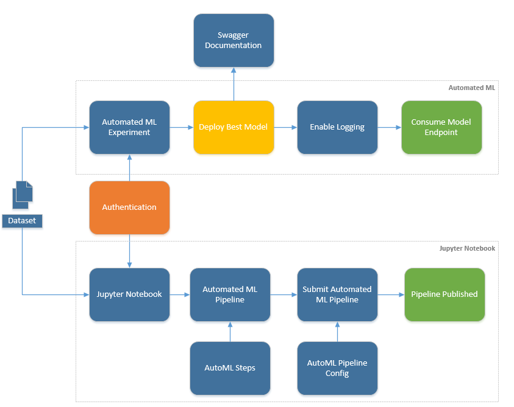. 

## Key Steps
### 1. Registered DataSet: 
Firstly, make sure the data is available in the dataset in order to begin the Auto ML process.
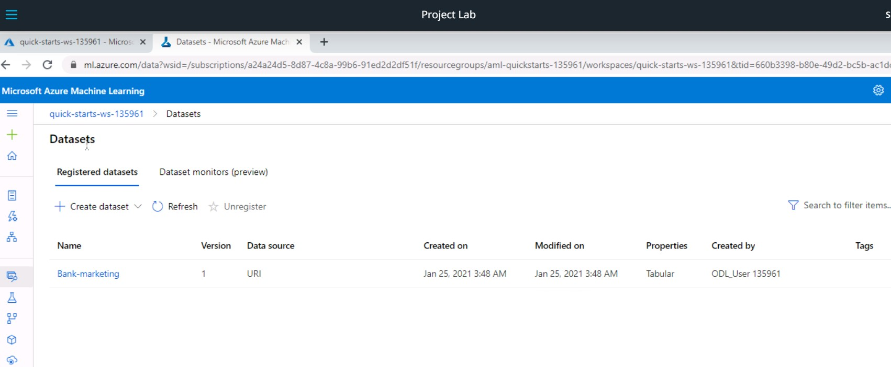

### 2. Authentication: 
This is an important step without which we cannot maintain smooth and automated flow of operations, without human intervention. Instead of human involvement during the proces, a 'Service Principal' can be defined with user specific permissions to ensure uninterrupted execution.

### 3. Automated ML Experiment:
After we login into the Azure Portal, we launch the Azure Machine Learning Studio and begin the process of creating Automated ML Experiment. We need to configure compute nodes and  ML task type such as classification, regression etc. In our case, we select 'Standard_DS12_v2' VM with 1 as the minimum number of nodes and 4 as maximum. And we select the Classification as the ML task type.  The experiment takes about 30mins to complete.

#### AutoML Completion
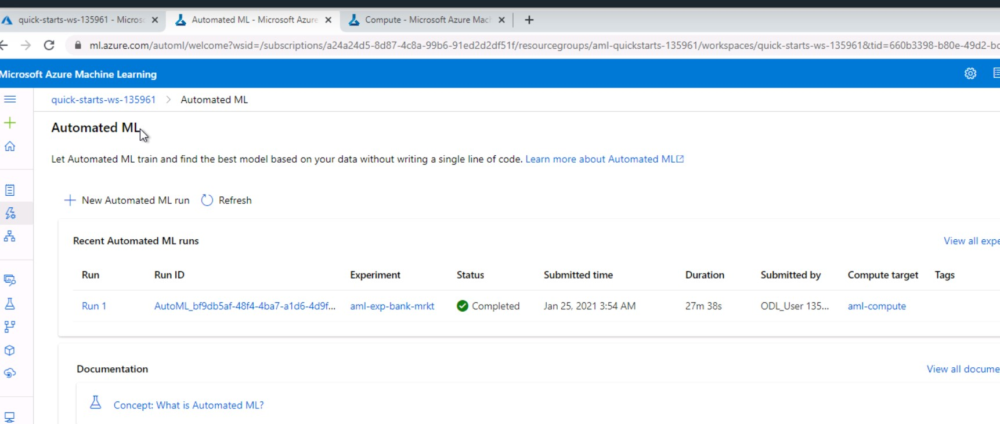

#### Best Model - Voting Ensemble
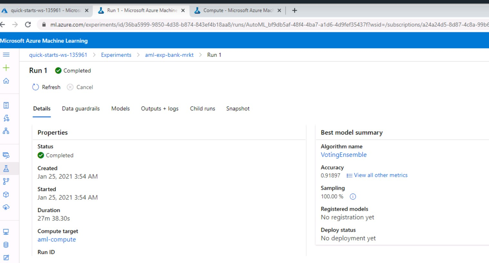

### 4. Deploy Best Model:
In our case, the best model is Voting Ensemble with accuracy of 0.91836. The users/stakeholders can consume the best model only if its deployed to production environment. To deploy we use the Azure Container Instance and enable Authentication configuration setting so that only authenticated users can access. We choose the best model for deployment and enable "Authentication" while deploying the model using Azure Container Instance (ACI).

#### Best Model Deployed
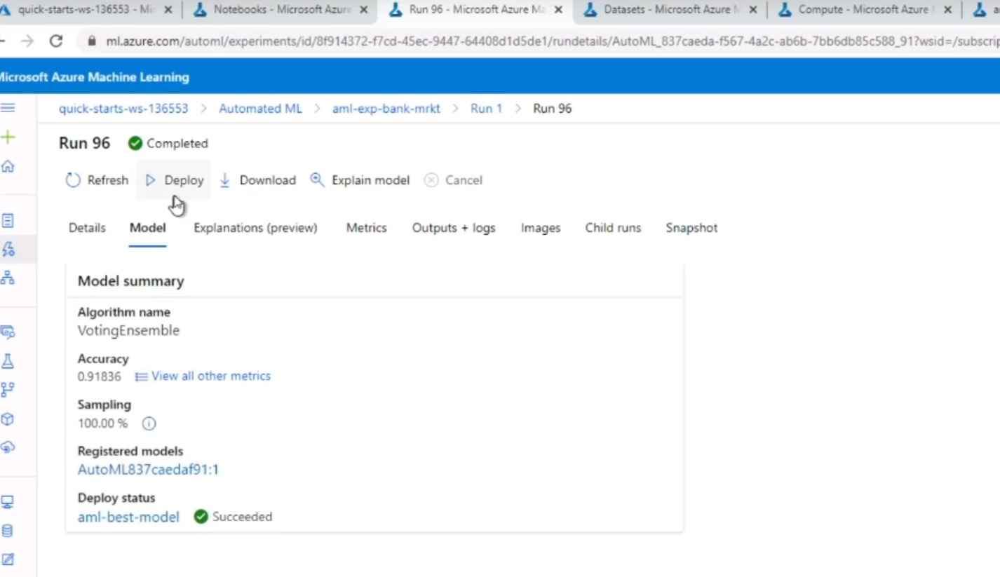

### 5. Enable Application Insights for Logging:

Application Insights is an Microsoft Azure service that can automatically detect performance anomalies, and it includes powerful analytics tools to help us diagnose issues. It's designed to help us continuously improve performance and usability. It can be enabled before or after the deployment process. In our case, Application Insights was disabled when the model was deployed. To enable Application Insights on already deployed model, we use Python SDK as shown below. 

The executed code in logs.py enables Application Insights.

```python
# load existing web service
service = Webservice(name=name, workspace=ws)

service.update(enable_app_insights=True)

logs = service.get_logs()
```
#### Application Insights Enabled
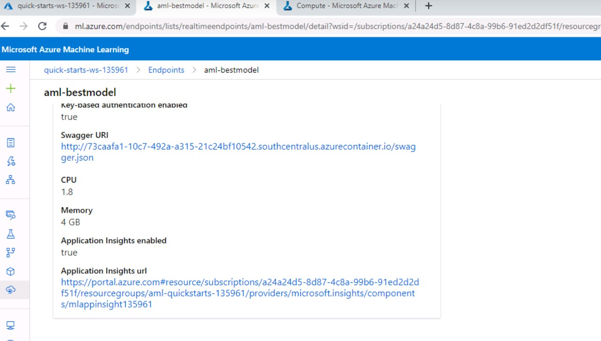

#### Python SDK Output after enabling

After Application Insights is enabled, using the code below, the logs print out on the terminal console that the app insights client is starting:
```python
logs = service.get_logs()
for line in logs.split('\n'):
    print(line)
```

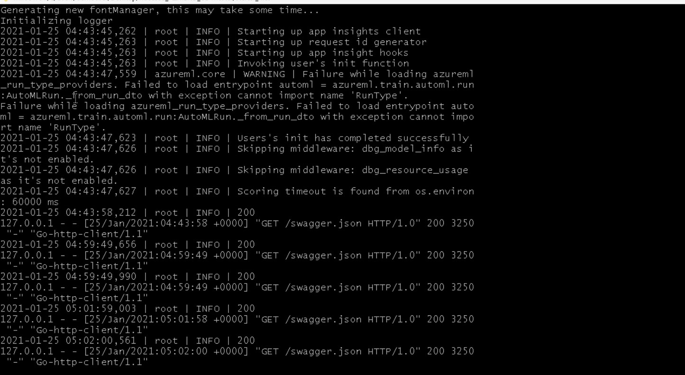

### 6. Swagger Documentation:
Swagger is a powerful yet easy-to-use suite of API developer tools for teams and individuals, enabling development across the entire API lifecycle, from design and documentation, to test and deployment. It helps build, document, and consume RESTful web services deployed in Azure ML Studio. It further explains what types of HTTP requests an API can consume, in this case like POST and GET. 

The files swagger.json and  swagger.sh are provided already. We update the swagger.sh script to run with a specific port number 9001. This spins up a docker container to run swagger on the mentioned port. We then run the serve.py script to run http server on port 8000 to host swagger.json. This localhost website documents the HTTP endpoint for a deployed model. After running the swagger.sh and serve.py scripts, the webpage displays the contents of the API for the model along with different HTTP requests supported.

#### Spin up docker
Below code is to pull the swagger-ui image from the docker registry and execute the 'docker run' command to spin up a docker instance using the fetched image.
```bash
docker pull swaggerapi/swagger-ui
docker run -p 9001:8080 swaggerapi/swagger-ui
```
#### Serve it via HTTP Server
Now that the docker is up and running, we host the swagger website locally using HTTP Server using the python script 'serve.py'. This enables us to host swagger.json on port 8000.
```bash
 $ python serve.py 8000
```

#### Swagger Website showing API Contents
Notice that the swagger website url is running on port 9001 as configured and the swagger.json is hosted on port 8000.
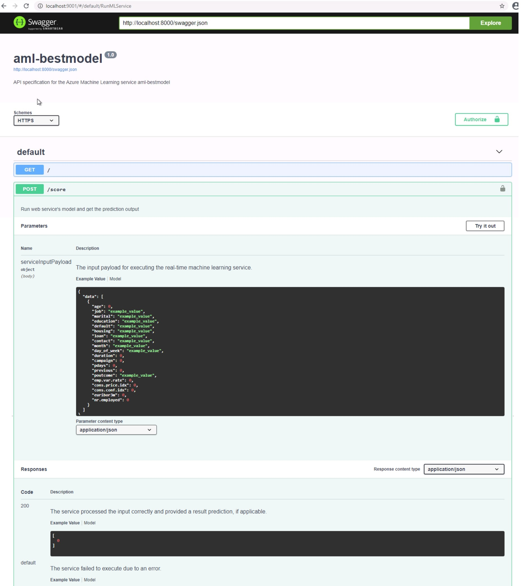

### 7. Consume Model Endpoint:

To consume the endpoint of the deployed best model, we prepare the endpoint.py script to update with the score URI and key. The score URI is http url of the RESTful service of the deployed model.  We initiate an input request, in this case via an HTTP POST request method to submit data. The HTTP GET is another request method to retrieve information from a web server. This creates a bi-directional flow of allowed information in Azure. In order to consume deployed service, we modify the URI and key to match the primary key for our service and RESTful URI generated after deployment as shown below.
```python
headers["Authorization"] = f"Bearer {key}"
resp = requests.post(scoring_uri, input_data, headers=headers)
```

And then we run the endpoint.py script.
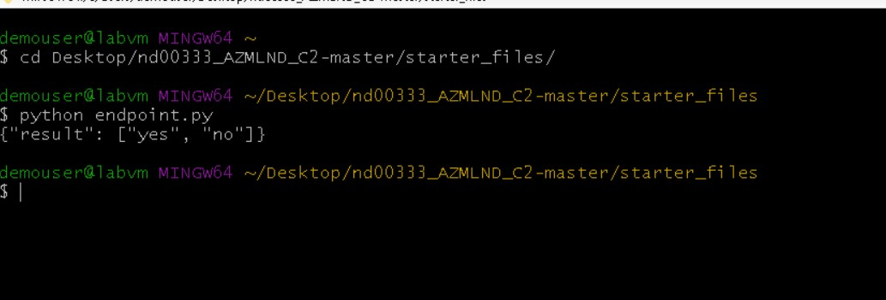

The output variable of endpoint.py script in this case predicts whether the bank's customer will subscribe to a particular scheme or not. Therefore the output displays yes, no.

### 8. Azure ML Pipeline with AutoMLStep

#### Azure ML Pipeline
We use ML pipelines to create a workflow that stitches together various ML phases. Then, we publish that pipeline for later access or sharing with others. We can then track ML pipelines to see how the model is performing in the real world and to detect any data drifts. ML pipelines are ideal for batch scoring scenarios, using various computes, reusing steps instead of rerunning them, as well as sharing ML workflows with others.

#### Azure ML Pipeline with AutoML
Azure Machine Learning's automated ML capability helps us discover high-performing models without reimplementing every possible approach. Combined with Azure Machine Learning pipelines, we can create deployable workflows that can quickly discover the algorithm that works best for the data. Automated ML in a pipeline is represented by an AutoMLStep object.
We use Jupyter Notebooks and Python SDK in Azure Machine Learning Studio to build ML Pipeline using AutoMLStep. 

In this notebook we execute following steps:

- Create an Experiment in an existing Workspace.
- Create or Attach existing AmlCompute to a workspace.
- Define data loading in a TabularDataset.
- Configure AutoML using AutoMLConfig.
- Use AutoMLStep
- Train the model using AmlCompute
- Explore the results.
- Test the best fitted model.
- Publish pipeline
- Run pipeline from HTTP endpoint

Few screenshots are following. However, for detailed results and outputs, please find the notebook here -> [aml-pipelines-with-automated-machine-learning-stepvv.ipynb](https://github.com/akmuzammil/ML_C2/blob/main/nd00333_AZMLND_C2/starter_files/aml-pipelines-with-automated-machine-learning-stepvv.ipynb)

#### Pipeline Running
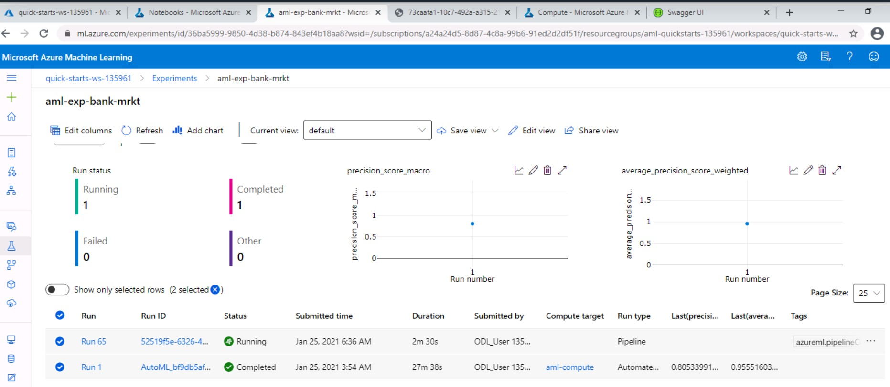
#### Publish Pipeline 
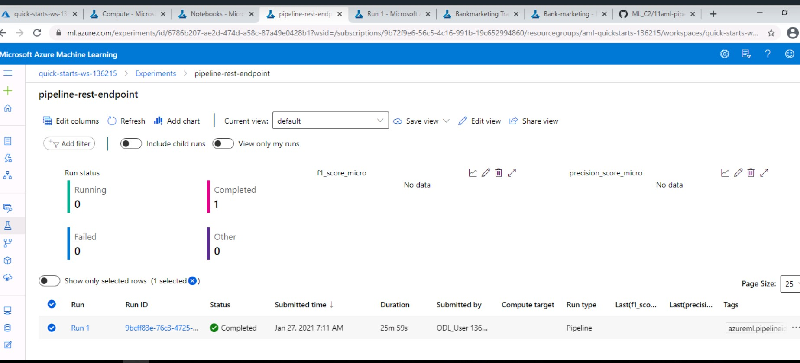
#### Published & Active Pipeline Endpoint
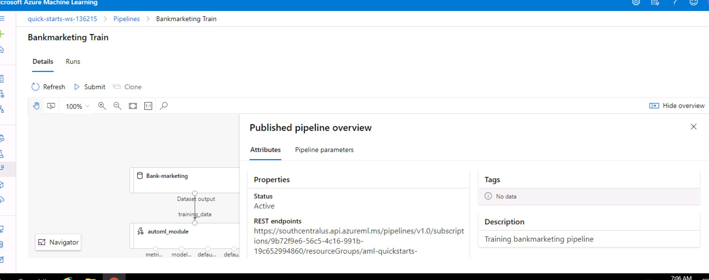

#### MLOps Summary

Now that the AutoML pipeline is published and active as shown above, we can leverage enormous benefits of ML pipelines for ML Operations. 
Some benefits are: 
- when the underlying data changes, the ML engineers can automatically address data drift issues.
- ML engineers can simply invoke the pipeline via the pipeline endpoint and re-use the steps instead of re-running.
- ML pipelines are ideal for batch scoring scenarios.
- pipelines can use various computes.
- sharing ML workflows with others.

## Screen Recording
[Operationalizing ML Pipelines in Microsft Azure](https://www.youtube.com/watch?v=6vXFxS_WAn4)

## Road Ahead

Azure Machine Learning manages the entire lifecycle of machine learning process, including model training, model deployment, and monitoring. We can use Event Grid to react to Azure Machine Learning events, such as the completion of training runs, the registration and deployment of models, and the detection of data drift, by using modern serverless architectures. We can then subscribe and consume events such as run status changed, run completion, model registration, model deployment, and data drift detection within a workspace.

We can use Event Grid for event driven actions such as:
- Send emails on run failure and run completion
- Use an Azure function after a model is registered
- Streaming events from Azure Machine Learning to various of endpoints
- Trigger an ML pipeline when drift is detected

## References

1. [AutoML](https://azure.microsoft.com/en-us/services/machine-learning/automatedml/)
2. [Swagger](https://swagger.io/about/)
