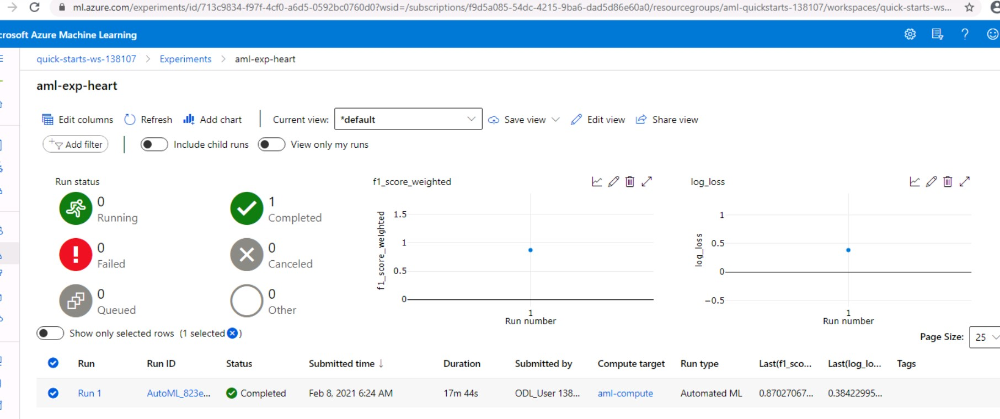
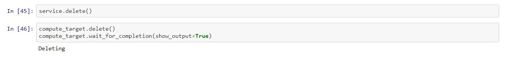

### Machine Learning using Microsoft Azure

# Capstone Project

Table of Contents
=================
  * [Overview](#overview)
  * [Architecture](#architecture)
  * [Project Steps](#project-steps)
    * [Import Data into Azure ML Dataset](#Import-Data-into-Azure-ML-Dataset)
    * [AutoML Model](#automl-model)
      - [AutoML Configuration](#automl-configuration)
      - [Submit AutoML Experiment](#Submit-AutoML-Experiment)
      - [RunDetails](#rundetails)
      - [Best AutoML Model](#Best-AutoML-Model)
    * [Hyperdrive Model](#hyperdrive-model)
      - [Hyperparameter Tuning using HyperDrive](#Hyperparameter-Tuning-using-HyperDrive)
      - [Submit the HyperDrive Run](#Submit-the-HyperDrive-Run)
      - [RunDetails](#rundetails-1)
      - [Best HyperDrive Model](#best-hyperdrive-model)
      - [Save and Register Model](#save-and-register-model)
    * [Comparison of the two models AutoML Model vs HyperDrive Model](#comparison-of-the-two-models-AutoML-Model-vs-HyperDrive-Model)
    * [Model Deployment](#model-deployment)
      - [Register Model](#register-model)
      - [Deploy Model](#deploy-model)
      - [Consume Model Endpoint](#consume-model-endpoint)
    * [Services Cleanup](#services-cleanup)
  * [Future Improvements](#future-improvements)
  * [Screen Recording](#screen-recording)
  * [Acknowledgements](#Acknowledgements)
  
This capstone project gives the opportunity to use the Azure Machine Learning knowledge that we have obtained so far to solve the problem of our interest. Our problem of interest is based on medical data to predict heart failure of given subject. This project has two parts - one to find best ML model and other to deploy the best model. Finding best ML model is further done in two ways: 
 
  #### 1- Automated ML (AutoML)
  #### 2- Hyperparameters tuning using HyperDrive.
  
The above methods generate output ML model each and then both models are compared to find the best model with highest accuracy. Then we deploy the best performing model. We then test the endpoint of the deployed ML model.
  
  
## Overview
This capstone project leverages Azure Machine Learning to help predict Heart Failure based on the data from University of California, Irvine Machine Learning Repository.
Cardiovascular diseases (CVDs) are the number one cause of deaths globally, taking an estimated 17.9 million lives each year, which accounts for 31% of all deaths worlwide.
Heart failure is a common event caused by CVDs and this dataset contains 12 features that can be used to predict mortality by heart failure. Most cardiovascular diseases can be prevented by addressing behavioural risk factors such as tobacco use, unhealthy diet and obesity, physical inactivity and harmful use of alcohol using population-wide strategies.
People with cardiovascular disease or who are at high cardiovascular risk (due to the presence of one or more risk factors such as hypertension, diabetes, hyperlipidaemia or already established disease) need early detection and management wherein a machine learning model can be of great help.

This project involves the loading and registering of this external data into Azure ML Workspace dataset, automated machine learning, hyperparameter tuning using HyperDrive,  comparison of two models and the deployment of best model. This is an effort to show how machine learning can be applied in the field of Medicine to help predict diseases that may affect millions of people.
 
The dataset contains 299 training examples in a csv file.

Source of data: [archive.ics.uci.edu](https://archive.ics.uci.edu/ml/machine-learning-databases/00519/heart_failure_clinical_records_dataset.csv)


## Architecture

The data is imported into dataset of the Azure ML Workspace. Then, we train using Automated ML (using Python SDK in Jupyter Notebook) and also using HyperDrive (using Python SDK in Jupyter Notebook). Results of both ways are compared to find the best model and deployed. The deployed model is available as RESTful webservice endpoint that can be tested by consuming by any client using REST API.


## Project Steps

### Import Data into Azure ML Dataset

The dataset contains 12 features and 1 label (death_event feature - we use as the target, states if the patient died or survived before the end of the follow-up period, that was 130 days on average), which report clinical, body, and lifestyle information, that we briefly describe below. Some features are binary: anaemia, high blood pressure, diabetes, sex, and smoking. The hospital physician considered a patient having anaemia if haematocrit levels were lower than 36%. 

12 clinical features:

- age: age of the patient (years)
- anaemia: decrease of red blood cells or hemoglobin (boolean)
- high blood pressure: if the patient has hypertension (boolean)
- creatinine phosphokinase (CPK): level of the CPK enzyme in the blood (mcg/L)
- diabetes: if the patient has diabetes (boolean)
- ejection fraction: percentage of blood leaving the heart at each contraction (percentage)
- platelets: platelets in the blood (kiloplatelets/mL)
- sex: woman or man (binary)
- serum creatinine: level of serum creatinine in the blood (mg/dL)
- serum sodium: level of serum sodium in the blood (mEq/L)
- smoking: if the patient smokes or not (boolean)
- time: follow-up period (days)

In this project, we predict the death event or Heart failure using the 12 features in the dataset. The target ("DEATH_EVENT") column indicates that the patient died (value=0) or survived (value=1) before the end of the follow-up period.


#### Data Loading Mechanism
The data can be loaded into Azure ML Workspace in couple of ways. One way is to download the data from UCI ML Repository and manually import into the Azure ML Workspace Dataset. Another way is to programmatically read using the python code block.

##### Manual in Azure ML Studio
- Method 1: Click on create dataset and import the data from local files once the data is downloaded from UCI ML Repository link, as shown below.


- Method 2: Programmatically read the data using HTTP url by python code, as shown below.


### AutoML Model

After we login into the Azure Portal, we launch the Azure Machine Learning Studio and begin the process of creating Automated ML Experiment using Python SDK. For this, we need to open the Jupyter Notebook from Azure ML Studio, load references and configure compute nodes, before preparing for the AutoML experiment. In our case, we select 'Standard_DS12_v2' VM with 1 as the minimum number of nodes and 4 as maximum. 

#### AutoML Configuration

Before we run the AutoML experiment, we need to create and define AutoML configuration parameters. We may use AutoML settings object or directly pass the parameters into AutoML Config constrcutor.


We use the AutoMLConfig class to configure parameters for AutoML experiment. We configure to run AutoML experiment to perform a classification task.

 - max_concurrent_iterations: is set to 5 and it represents the maximum number of iterations that would be executed in parallel. This value should be less than or equal to the maximum number of nodes as compute clusters support one interaction running per node.
 - primary_metric: is set to accuracy and this is the metric that Automated Machine Learning will optimize for model selection.
 - n_cross_validation: parameter specifies how many cross validations to perform when user validation data is not specified.
 - enable_early_stopping- is set to true. This enables early termination if the score is not improving in the short term.
 - featurization: 'auto'	indicates featurization step should be done automatically or not, or whether customized featurization should be used.
 - label_column_name: the target ("DEATH_EVENT") column indicates that the patient died (value=0) or survived (value=1) before the end of the follow-up period.
 - task: task is set to classification as the aim of our model is to classify "DEATH_EVENT" column.
 - compute_target: remote compute target vm_size='STANDARD_DS3_V2', min_nodes=1, max_nodes=4

#### Submit AutoML Experiment

AutoML Experiment object is created using the aforementioned AutoML configuration and submitted to execute on the remote target compute cluster.



AutoML iterates over many combinations of machine learning algorithms and hyperparameters. It then finds the best-fit model based on the chosen primary metric.

#### RunDetails

Below is the screenshot of RunDetails widget that displays some information about the running AutoML experiment.


#### Best AutoML Model

Once the experiment successfully executes, we get the best AutoML model. In our case, VotingEnsemble is the best model with an accuracy of 0.87633.


##### Best Run
Below is the best run out of multiple runs that AutoML executed.


The result model is saved by registering in the Azure ML Workspace.

### Hyperdrive Model
To begin hyperparameter tuning using HyperDrive, we prepare a custom-coded model based on standard scikit-learn Logistic Regression. This custom python model uses logistic regression algorithm for classification and which will be used by HyperDrive to optimize the hyperparameters.

#### Custom Python model based on scikit-learn's Logistic Regression

##### Preparing Python Model used for Training - train.py:

###### Import Data
A custom python model is prepared that will be used for training. The model imports the data from the given dataset.
```python
# load the heart_failure_clinical_records_dataset
ds= TabularDatasetFactory.from_delimited_files(path="https://archive.ics.uci.edu/ml/machine-learning-databases/00519/heart_failure_clinical_records_dataset.csv")
```
###### Clean Data
After the data is imported, the data is cleaned using the function clean_data where we first drop missing values.
```python
def clean_data(data):
    
    x_df = data.to_pandas_dataframe().dropna()
    y_df = x_df.pop("DEATH_EVENT")
    return x_df, y_df

x, y = clean_data(ds)
```

###### Split data into train and test sets.
Then we split the data into train and test sets with 30% of the data used as test.
```python
# Split data into training set and test set
x_train, x_test, y_train, y_test = train_test_split(x, y, test_size=0.30, random_state=0)
```
###### Define Hyperparameters as Arguments for Logistic Regression
```python
# Set regularization parameter
parser = argparse.ArgumentParser()

parser.add_argument('--C', type=float, default=1.0, help="Inverse of regularization strength. Smaller values cause stronger regularization")
parser.add_argument('--max_iter', type=int, default=100, help="Maximum number of iterations to converge")
parser.add_argument('--regularization', type=float, dest='reg_rate', default=0.01, help='regularization rate')
args = parser.parse_args()
```
###### Logistic Regression
The classification technique used is the Logistic Regression.
```python
# Train a logistic regression model
print('Training a logistic regression model with regularization rate of', reg)
run.log('Regularization Rate',  np.float(reg))
run.log("Regularization Strength:", np.float(args.C))
run.log("Max iterations:", np.int(args.max_iter))
model = LogisticRegression(C=args.C,max_iter=args.max_iter, solver="liblinear").fit(x_train, y_train)
```
We then fit the model and score against the test set to find the accuracy of the model.
```python
 calculate accuracy
y_sc = model.predict(x_test)
acc = np.average(y_sc == y_test)
print('Accuracy:', acc)
run.log('Accuracy', np.float(acc))

# calculate AUC
y_scores = model.predict_proba(x_test)
auc = roc_auc_score(y_test,y_scores[:,1])
print('AUC: ' + str(auc))
run.log('AUC', np.float(auc))
```

The model is ready and saved as train.py.


#### Hyperparameter Tuning using HyperDrive

Once the python model (train.py) is ready, we start our exercise, first, by using HyperDrive to tune the hyperparameters to achieve higher accuracy metric. We open Jupyter Notebook, and prepare the hyperparameter configuration before executing hyperdrive experiment.
Azure Machine Learning includes a hyperparameter tuning capability through Hyperdrive experiments. These experiments launch multiple child runs, each with a different hyperparameter combination. The run producing the best model (as determined by the logged target performance metric for which you want to optimize) can be identified, and its trained model selected for registration and deployment.
##### Hyperparameters
Hyperparameters are adjustable parameters that let us control the model training process. For example, with random forest, we decide the number of estimators (decision trees) and the depth of each tree. Model performance depends heavily on hyperparameters.

Hyperparameter tuning, also called hyperparameter optimization, is the process of finding the configuration of hyperparameters that results in the best performance. The process is typically computationally expensive and manual. HyperDrive lets us automate hyperparameter tuning and run experiments in parallel to efficiently optimize hyperparameters.


In this section, we tuned the Regularization Strength (C), Regularization Rate (regularization) and the Max Iterations (max_Iter) with the Hyperdrive method. We have used the random parameter sampler for parameter sampling.
```python
# Sample a range of parameter values
param_sampling = RandomParameterSampling({
    "--C" : uniform(0.1,1),
    "--max_iter" : choice(50,100,150,200),
    "--regularization": choice(0.001, 0.005, 0.01, 0.05, 0.1, 1.0)
    }
)
```
Note the the lower values of C cause stronger regularization. And max_iter specifies the maximum number of iterations for the model to converge. The benefits of the chosen parameters sample are to reduce the computational costs and speed up the results reducing the max_iter for example.

###### Early Termination Policy - Bandit

Bandit is an early termination policy based on slack factor/slack amount and evaluation interval. The policy early terminates any runs where the primary metric is not within the specified slack factor/slack amount with respect to the best performing training run. The Bandit policy takes the following configuration parameters:

**slack_factor or slack_amount**: The slack allowed with respect to the best performing training run. slack_factor specifies the allowable slack as a ration. slack_amount specifies the allowable slack as an absolute amount, instead of a ratio.

**evaluation_interval**: Optional. The frequency for applying the policy. Each time the training script logs the primary metric counts as one interval.

**delay_evaluation**: Optional. The number of intervals to delay the policy evaluation. We may use this parameter to avoid premature termination of training runs. If specified, the policy applies every multiple of evaluation_interval that is greater than or equal to delay_evaluation.
```python
early_termination_policy = BanditPolicy(evaluation_interval=2, slack_factor=0.1)
```
Any run that doesn't fall within the slack factor or slack amount of the evaluation metric with respect to the best performing run will be terminated.

###### Create a HyperDriveConfig using the estimator, hyperparameter sampler, and policy.
Prepare the HyperDrive Configuration to start the hyperdrive run. It consists of hyperparameters, defining the parameter search space, specifying a primary metric to optimize, specifying early termination policy for low-performing runs, etc.

We specify the primary metric that the hyperparameter tuning optimizes. Each training run is evaluated for the primary metric. The early termination policy uses the primary metric to identify low-performance runs.

- primary_metric_name: The name of the primary metric needs to exactly match the name of the metric logged by the training script
- primary_metric_goal: It can be either PrimaryMetricGoal.MAXIMIZE or PrimaryMetricGoal.MINIMIZE and determines whether the primary metric will be maximized or minimized when evaluating the runs.
Below configuration is to maximize 'AUC' (area under the curve).
```python
# Create your estimator and hyperdrive config
estimator = SKLearn(source_directory=".",
                          inputs=[dataset.as_named_input('heartfailure')], # Pass the dataset as an input...
                          entry_script='train.py',
                          compute_target = cpu_cluster)

# Configure hyperdrive settings
hyperdrive_run_config = HyperDriveConfig(estimator=estimator, 
                          hyperparameter_sampling=param_sampling, 
                          policy=early_termination_policy, 
                          primary_metric_name='AUC', 
                          primary_metric_goal=PrimaryMetricGoal.MAXIMIZE, 
                          max_total_runs=40,
                          max_concurrent_runs=4)
```
#### Submit the HyperDrive Run
Run the experiment to execute the HyperDrive.
```python
# Submit your experiment
run = experiment.submit(config=hyperdrive_run_config, show_output=True)
```

#### RunDetails
We use RunDetails widget to get information about the running HyperDrive experiment.


#### Best HyperDrive Model
Once the HyperDrive experiment finished running we get the best models, with its AUC metric and its hyperparameters as shown below. 

```python
Best Run Id:  HD_22c8c5be-dad4-4437-951f-6ffcbcb15b5a_8
 -AUC: 0.8410138248847926
 -Accuracy: 0.7888888888888889
 -Regularization Rate: ['--C', '0.30848904476653083', '--max_iter', '100', '--regularization', '0.005']
```

#### Save and Register Model
Below shows how to save and register the model for further use later (to deploy or share etc).


### Comparison of the two models AutoML Model vs HyperDrive Model

Below is the comparison between the two models' performance.
- The HyperDrive experiment focuses on only one type of algorithm and tries to find the best hyperparameters.
- Whereas the AutoML tries different algorithms and parameters to find the best suitable algorithm for the data and produce the best model. 

Metric | HyperDrive | AutoML
------------ | ------------ | -------------
Accuracy | 0.7888888888888889 | 0.87633
Model | Logistic Regression | Voting Ensemble

### Model Deployment

Based on the comparison above, we found that the AutoML model is best model in terms of accuracy and performance. Therefore, we select this best model for deployment.

#### Register Model 

Before we start deploying the model, we register it in the Azure ML Workspace, by running below code statement. 


#### Deploy Model

We will deploy the model using Azure Container Instance (ACI). For this, we need inference configuration setting and inference score python script. And then, we run the deploy command.


##### Deployed Model as Service

The model is deployed as a web service as shown below. It can be conveniently accessed via HTTP REST API by any client application.


#### Consume Model Endpoint
We consume the model endpoint using the HTTP REST API. For this we need the model endpoint URL and the primary key for authentication, as shown below. 


Then we pass the input data in json format. The service receives the input data and it will return the predictions.


#### Services Cleanup

After all the steps, we can delete the ACI service and also we can delete the Compute cluster in order to clean up services.



## Future Improvements

- The model can be converted to ONXX format and be deployed and consumed on Edge devices.
- More complex techniques such as deep learning/neural networks can be employed to study the performance.


## Screen Recording

[Automated ML vs HyperDrive Tuning](https://www.youtube.com/watch?v=7uIQp8DrO5M)


## Acknowledgements
1. Microsoft
2. Udacity
3. UCI
